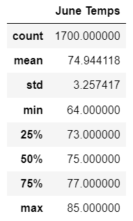
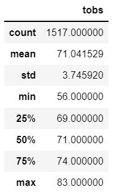

# Surf's Up!

## Purpose of the Analysis
We are working to get a new business idea off the ground, a surk-n-shake shop in Hawaii that will serve surfboards and ice creams to locals and tourists all year round. Our main investor recommends to investigate weather data on Oahu to make our business plan bullet-proof.

## Key Findings
There are 3 key differences in weather between June and December:

<table align="right">
  <tr height=50px>
    <th>Temperatures in Oahu in June</th>
    <th>Temperatures in Oahu in December</th>
  </tr>
  <tr>
    <td> 
    <td> 
  </tr>
</table>

-
-
-

## Summary
High-level summary of the results and 2 additional queries to gether more weather data
-
-
